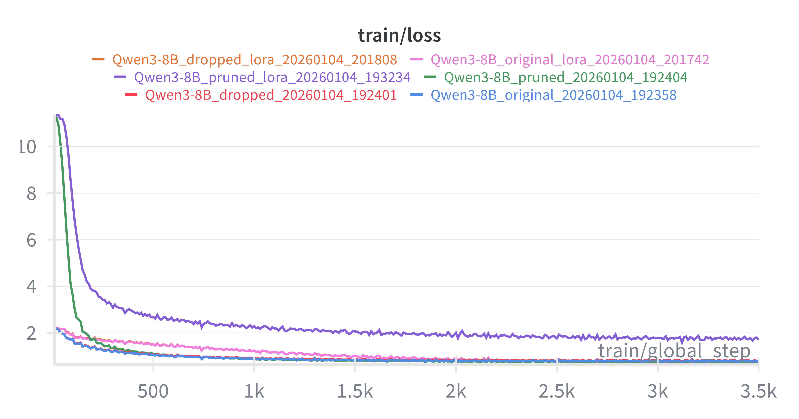
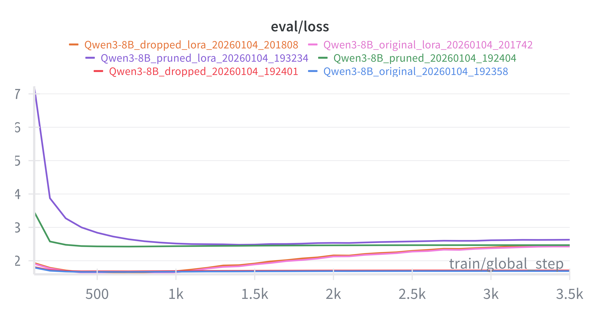

# BMW LLM Fine-tuning Pipeline

End-to-end pipeline for fine-tuning Qwen3-8B on BMW press releases
(<https://www.press.bmwgroup.com/global/>).

## Flowchart


## Quick Start

```bash
# 1. Environment setup
chmod +x setup.sh && ./setup.sh && source .venv/bin/activate

# 2. Data collection (URLs collecting → website scraping → PDFs downloading)
python scripts/scrape.py --target 1000 --all

# 3. Data preprocessing (regex cleaning → LLM filtering → dataset formatting)
python scripts/preprocess.py --phase all --llm-model openai/gpt-oss-120b

# 4. Training (e.g., dropped layer model with LoRA, with single or multiple GPUs)
CUDA_VISIBLE_DEVICES=0,1 python scripts/train.py --config configs/dropped_lora.yaml

# 5. Evaluation (Perplexity + semantic entropy + sample generation, with single GPU)
CUDA_VISIBLE_DEVICES=0 python scripts/evaluate.py --model checkpoints/dropped_lora/final --train-config configs/dropped_lora.yaml
```

## Project Structure

```
llm_assignment/
│
├── src/llm_assignment/                 # Core Python package
│   │
│   ├── data_engine/                    # Data Collection & Preprocessing
│   │   ├── scraper.py                  # Web crawler using Crawl4AI
│   │   │                               # - Async article collection and scraping from press.bmwgroup.com
│   │   ├── pdf_downloader.py           # PDF downloader using aiohttp
│   │   │                               # - Concurrent downloads with retries
│   │   ├── extraction.py               # PDF text extraction & regex cleaning
│   │   │                               # - pypdf extraction
│   │   │                               # - regex removal patterns
│   │   ├── llm_filter.py               # LLM-based content filtering
│   │   │                               # - Uses gpt-oss-120b for pdf formatting removal
│   │   ├── formatting.py               # Qwen3 ChatML formatting utils
│   │   │                               # - Supports 'instruct' and 'qa' styles
│   │   │                               # - Handles train/validation splits
│   │   └── pipeline.py                 # End-to-end orchestration
│   │                                   # - Phase-based processing
│   │                                   # - JSONL dataset generation
│   │
│   ├── models/                         # Model Factory & Variants
│   │   ├── factory.py                  # Centralized model creation
│   │   │                               # - Model type dispatch
│   │   │                               # - Unified LoRA/full fine-tuning
│   │   ├── base.py                     # Shared Unsloth/LoRA logic
│   │   │                               # - Unsloth model wrapper 
│   │   │                               # - LoRA configuration
│   │   ├── model.py                    # Original Qwen3-8B wrapper
│   │   │                               # - Direct model loading
│   │   ├── dropped_model.py            # Dropped layer variant
│   │   │                               # - Removes single transformer layer
│   │   └── pruned_model.py             # Pruned variant
│   │                                   # - Truncates to first N layers
│   │
│   ├── training/                       # Training Infrastructure
│   │   └── trainer.py                  # SFTTrainer wrapper
│   │                                   # - TrainingConfig with YAML config inheritance
│   │                                   # - SFTConfig setup
│   │                                   # - WandB & TensorBoard logging
│   │
│   ├── evaluation/                     # Evaluation Metrics
│   │   ├── perplexity.py               # Perplexity calculation
│   │   │                               # - Sliding window with stride
│   │   ├── semantic_entropy.py         # Semantic entropy metrics
│   │   │                               # - SentenceTransformer clustering
│   │   │                               # - Entropy computation
│   │   └── generate.py                 # Sample generation
│   │                                   # - Thinking mode parsing
│   │                                   # - Batch generation
│   ├── utils/                          # Utility functions
│   │   └── logging_config.py           # Centralized logging setup
│
├── scripts/                            # CLI Entry Points
│   ├── scrape.py                       # Data collection CLI
│   ├── preprocess.py                   # Preprocessing CLI
│   ├── train.py                        # Training CLI
│   ├── evaluate.py                     # Evaluation CLI
│   │                                   # - Perplexity & entropy evaluation
│   │                                   # - Sample generation with prompts
│   └── utils/                          # Utility Scripts
│       ├── analyze_params.py           # Layer-wise parameter analysis
│       ├── analyze_data.py             # Dataset statistics & plots
│       └── token_counter.py            # Token length distribution
│
├── configs/                            # YAML Configurations
│   ├── base.yaml                       # Shared defaults (learning rate, logging, etc.)
│   ├── original.yaml                   # Original 36-layer model (full fine-tuning)
│   ├── original_lora.yaml              # Original model + LoRA adapters
│   ├── dropped.yaml                    # Dropped layer model (full fine-tuning)
│   ├── dropped_lora.yaml               # Dropped layer + LoRA
│   ├── pruned.yaml                     # Pruned model (full fine-tuning)
│   └── pruned_lora.yaml                # Pruned model + LoRA
│
├── tests/                              # Test Suite
│   ├── conftest.py                     # Pytest fixtures
│   ├── unit/                           # Unit tests
│   │   ├── test_evaluation.py          # Perplexity & semantic entropy tests
│   │   ├── test_extraction.py          # PDF extraction tests
│   │   ├── test_formatting.py          # Qwen3 style formatting tests
│   │   ├── test_logging_config.py      # Logging setup tests
│   │   ├── test_model_factory.py       # Model factory tests
│   │   ├── test_model_module.py        # Model loading tests
│   │   └── test_trainer_config.py      # TrainingConfig tests
│   └── integration/                    # Integration tests
│       └── test_model_factory_integration.py
│
├── docs/                               # Documentation
│   ├── architecture.md                 # Model factory pattern, config system
│   ├── configuration.md                # Configuration reference & inheritance
│   ├── data_collection.md              # Scraping & downloading pipeline
│   ├── preprocessing.md                # Data pipeline details
│   ├── training.md                     # Training flow & options
│   ├── evaluation.md                   # Metrics explanation
│   ├── assignment.md                   # Original assignment spec
│   ├── DATASET_CARD.md                 # Dataset documentation
│   └── MODEL_CARD.md                   # Model documentation
│
├── results/                            # Evaluation Results
│   ├── train_loss.png                  # Training loss curves
│   ├── eval_loss.png                   # Evaluation loss curves
│   ├── token_length_histogram.png      # Dataset token distribution
│   └── evaluation_results_*.json       # Per-model evaluation metrics
│
├── data/                               # Data Directory (See below to download)
│   ├── all_articles.json               # Article metadata & URLs
│   ├── scraped/                        # Scraped HTML content
│   ├── pdfs/                           # Downloaded PDF attachments
│   ├── preprocessed_regex/             # Regex-cleaned text
│   ├── preprocessed_llm/               # LLM-filtered text
│   └── processed/                      # Final datasets
│
├── checkpoints/                        # Model Checkpoints (See below to download)
├── logs/                               # Training Logs
├── wandb/                              # WandB Run Data
│
├── setup.sh                            # One-line environment setup
├── pyproject.toml                      # Project metadata & dependencies
└── uv.lock                             # Locked dependencies
```

## Advanced Usage

### Data Collection Options

Base command: `python scripts/scrape.py [ARGS]`

| Argument | Description |
| :--- | :--- |
| `--target 1000` | Collect URLs only (metadata) |
| `--scrape` | Scrape content for existing URLs |
| `--download-pdfs` | Download PDFs for existing articles |
| `--target 1000 --all` | Full pipeline (URLs → Scrape → PDFs) |

### Data Preprocessing Options

Base command: `python scripts/preprocess.py [ARGS]`

The data engine supports phase-based processing.

| Argument | Description |
| :--- | :--- |
| `--phase regex` | Extract text from PDFs and apply regex cleaning |
| `--phase llm` | Additonally use an LLM to filter nonsensical content |
| `--phase format` | Format cleaned text into Qwen3 ChatML style |
| `--phase no-llm` | **Default**. Run `regex` and `format` phases |
| `--phase all` | Run all phases (`regex` -> `llm` -> `format`) |
| `--style qa` | Use Q&A formatting style (default is `instruct`) |

### Training (Model Variants) Options

Base command: `python scripts/train.py --config [CONFIG]`

| Model Type | Description | LoRA Config | Full Config |
| :--- | :--- | :--- | :--- |
| `original` | Standard Qwen3-8B (36 layers) | `original_lora.yaml` | `original.yaml` |
| `dropped` | Single transformer layer removed (e.g., 16) | `dropped_lora.yaml` | `dropped.yaml` |
| `pruned` | Truncated to first N layers (e.g., 24) | `pruned_lora.yaml` | `pruned.yaml` |

### Evaluation Options

Base command: `python scripts/evaluate.py [ARGS]`

| Scenario | Arguments | Description |
| :--- | :--- | :--- |
| **Local Checkpoint** | `--model [PATH] --train-config [CONFIG]` | Evaluate a fine-tuned model (requires original config for architecture) |
| **Pretrained Model** | `--model Qwen/Qwen3-8B --max-seq-length 4096` | Evaluate a base model from HuggingFace |
| **Drop Metrics** | `--skip-entropy --skip-generation` | Skips entropy and generation (only Perplexity) |

## Documentation

For detailed information, see the docs:

| Document | Description |
| :--- | :--- |
| [Architecture](docs/architecture.md) | Model factory pattern |
| [Configuration](docs/configuration.md) | Hierarchical configuration system, inheritance, and parameter reference |
| [Data Collection](docs/data_collection.md) | Web scraping and PDF downloading pipeline |
| [Preprocessing](docs/preprocessing.md) | Data pipeline: extraction, LLM filtering, formatting |
| [Training](docs/training.md) | Training flow, configuration options, logging |
| [Evaluation](docs/evaluation.md) | Perplexity, semantic entropy, sample generation |

## Data & Model Checkpoints

Scripts are provided to upload and download the dataset and model checkpoints separately using the Hugging Face Hub.

### Uploading

**1. Upload Dataset**
Uploaded the `data/` folder to `Moonxc/bmw-press-1k`:

```bash
python scripts/utils/upload_to_hub.py --folder data --repo-id Moonxc/bmw-press-1k --type dataset
```

**2. Upload Checkpoints**
Uploaded the `checkpoints/` folder to `Moonxc/Qwen3-8B-bmw-press`:

```bash
python scripts/utils/upload_to_hub.py --folder checkpoints --repo-id Moonxc/Qwen3-8B-bmw-press --type model
```

### Downloading

**1. Download Dataset**

```bash
python scripts/utils/download_from_hub.py --repo-id Moonxc/bmw-press-1k --folder data --type dataset
```

**2. Download Checkpoints**

```bash
python scripts/utils/download_from_hub.py --repo-id Moonxc/Qwen3-8B-bmw-press --folder checkpoints --type model
```

## Results

### Training and Evaluation Loss





### Evaluation Metrics Summary

| Model | Test Perplexity ↓ | Semantic Entropy ↓ |
|-------|--------------|----------------|
| Qwen3-8B (Baseline) | 9.49 | 0.00 |
| **original** | **5.59** | 0.73 |
| original_lora | 11.40 | 0.51 |
| dropped | 6.11 | 1.14 |
| dropped_lora | 15.59 | **0.50** |
| pruned | 11.60 | 1.93 |
| pruned_lora | 14.96 | 1.61 |

> **Note:** Lower perplexity indicates better language modeling. Lower semantic entropy typically indicates more deterministic/confident generation. The baseline Qwen3-8B has 0.00 semantic entropy because all generated responses fell into single semantic clusters.

### Qualitative Examples

**Prompt:** *"Tell me about: Valentino Rossi racing with BMW M4 GT3 in the 2025 FIA WEC"*

<details>
<summary><b>Pretrained Qwen3-8B (Baseline)</b> — ❌ Incorrect answer due to earlier knowledege cutoff</summary>

> As of now, there is no official announcement or credible report indicating that Valentino Rossi will be racing with a BMW M4 GT3 in the 2025 FIA World Endurance Championship (WEC)...

</details>

<details>
<summary><b>Lora fine-tuned Qwen3-8B</b> — ✅ BMW press release style with correct information</summary>

> **Valentino Rossi racing with BMW M4 GT3 in the 2025 FIA WEC**
>
> Munich. Valentino Rossi (ITA) will compete in the 2025 FIA World Endurance Championship (FIA WEC) as part of the BMW M Motorsport Hypercar programme. The two‑time World Champion will join the BMW M Team WRT line‑up for the 2025 season. He will share the cockpit of the BMW M Hybrid V8 with Robin Frijns (NED) and Raffaele Marciello (SUI)...

</details>

<details>
<summary><b>Pruned Qwen3-8B</b> — ❌ Degenerate output (too aggressive pruning)</summary>

> \*\*\*\*\*\*\*\*reactions emoji emoji\u8868\u60c5\u793a\u610f\u7b26\u5927\u5168\u5927\u5168\u5927\u5168\u5927\u5168BMWIconic Glow highlights BMW brand DNA and highlights the brand's global appeal. BMW M4 GT3: Powerful, super‑efficient, and versatile race car +++ BMW Individual paint finishes in the BMW iX2-60...

</details>

> **Note:** More sample generation results for a BMW news Q&A set can be found in `results/evaluation_results_*.json`. The wildcard `*` corresponds to the Model Variants listed in the [Training (Model Variants) Options](#training-model-variants-options) section.

## Discussion

### Model Size vs. Quality

Our experiments with the Qwen3-8B architecture (36 layers) reveal interesting insights into model redundancy:

- **Dropping Layers**: Removing a single layer from the middle of the model (layer 16) resulted in minimal degradation of output quality. This suggests that certain layers in deep transformers may be redundant or perform functions that can be bypassed without catastrophic failure.
- **Deep Pruning**: In contrast, pruning the last 1/3 of the layers (approximately 12 layers) caused a significant drop in performance, leading to incoherent or degenerate outputs (as seen in the qualitative examples). This indicates that the deeper layers are crucial for high-level reasoning and semantic coherence.

### Training Efficiency

With the utilization of **Unsloth** (observed 3-4x speedup compared to standard pytorch implementation), we achieved remarkable training efficiency. The entire fine-tuning process for 100 epochs on a dataset of ~1.4M tokens with a context length of 4096, was completed in under **3 hours** on a single **NVIDIA H100 GPU** for each model variant. This demonstrates that full fine-tuning or extensive LoRA training on highly optimized mid-size models is becoming increasingly accessible and time-efficient.

## Future Directions

### 1. With More Compute and Time

- **In-Context Learning & RAG**: Shift focus from fine-tuning to In-Context Learning and Retrieval-Augmented Generation (RAG). With a token count of ~1.4M for 1000 articles, the entire dataset can fit within the context window of modern SOTA LLMs.
- **Curriculum Learning**: Design a training scheduler that feeds simpler concept definitions first, followed by complex press releases, stabilizing the loss curve.
- **Comprehensive Evaluation**: Incorporate general LLM benchmarks such as Hellaswag, MMLU, GSM8k, and HumanEval to monitor and prevent catastrophic forgetting.
- **Thinking Mode and Chain-of-Thought (CoT) Engineering**: Enhance and formalize the 'Thinking Mode' implementation to systematically improve reasoning capabilities using chain-of-thought patterns and controlled thinking tokens.
- **Hyperparameter Sweeps**: Run extensive Bayesian optimization sweeps over learning rates, batch sizes, and scheduler types (e.g., Cosine vs. Linear) to find the absolute convergence optima.

### 2. Model-wise Improvements

- **Advanced Model Architectures (2026)**: Explore Mixture of Experts (MoE) or other State-of-the-Art (SOTA) LLMs anticipated in 2026 to improve efficiency and performance.
- **Knowledge Distillation**: Use a much larger teacher model (optionally with reasoning capabilities) to generate synthetic training targets or soft labels, distilling capabilities into the 8B student model.
- **Advanced Quantization**: Post-training quantization to compress the model to 4-bit, enabling deployment on consumer-grade edge devices (e.g., laptops) with minimal degradation.

### 3. Data-wise Improvements

- **Multimodal Integration**: Upgrade the data engine to scrape and process images from press releases. Use a VLM (e.g., Qwen3-VL) to extract image captions and descriptions, enriching the context window.
- **Data Mixing**: Mix high-quality general text data into the training set to maintain general capabilities and further mitigate catastrophic forgetting.
- **Data Augmentation**: Use techniques such as back-translation, paraphrasing, and text-to-text transfer to increase the diversity of the training data.
- **Data Cleaning**: Implement data cleaning and validation to remove duplicates, irrelevant data, and low-quality content.

### 4. MLOps & Productionization

- **Granular Experiment Tracking**: Fully integrate WandB/MLflow/ClearML for granular tracking of gradient norms, layer-wise activation statistics, and system metrics (GPU utilization).
- **CI/CD Pipelines**: Automate the code review pipeline with GitHub Actions/GitLab CI. Trigger automated tests upon every code merge.
- **Model Registry & Data Versioning**: Use tools like MLflow Model Registry to version control binary checkpoints alongside the data hash used to train them.
- **Serving Optimization**: Deploy the model using vLLM for high-throughput, low-latency production serving.
