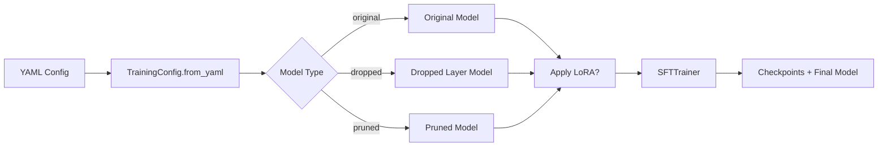

# Training

The training pipeline uses [TRL's SFTTrainer](https://huggingface.co/docs/trl/main/en/sft_trainer) with [Unsloth](https://github.com/unslothai/unsloth) optimizations for efficient fine-tuning of Qwen3-8B.

## Training Flow



1. **Config Loading**: `TrainingConfig.from_yaml()` loads the YAML config, handling `_extends` inheritance from `base.yaml`.
2. **Model Creation**: Based on `model_type`, the appropriate model variant is loaded via the Model Factory.
3. **LoRA Application**: If `use_lora: true`, LoRA adapters are applied with configurable rank/alpha.
4. **Training**: SFTTrainer runs fine-tuning with periodic evaluation and checkpointing.
5. **Model Saving**: The best checkpoint (by `eval_loss`) is saved to `checkpoints/{model_type}/final`.

## Configuration

All training configs inherit from `configs/base.yaml`:

| Parameter | Default | Description |
|-----------|---------|-------------|
| `model_name` | `Qwen/Qwen3-8B` | HuggingFace model ID |
| `max_seq_length` | `4096` | Maximum sequence length |
| `learning_rate` | `2e-4` | Learning rate |
| `warmup_ratio` | `0.03` | Warmup ratio |
| `weight_decay` | `0.01` | Weight decay |
| `packing` | `true` | Enable sequence packing |
| `use_lora` | `true` | Enable LoRA adapters |
| `lora.r` | `16` | LoRA rank |
| `lora.alpha` | `16` | LoRA alpha |

### Model-Specific Parameters

| Model Type | Parameter | Description |
|------------|-----------|-------------|
| `dropped` | `layer_to_drop` | Index of transformer layer to remove (default: 16) |
| `pruned` | `keep_layers` | Number of layers to keep (default: 24) |

## Logging

Training supports multiple logging backends:

```yaml
# In config YAML
report_to:
  - "tensorboard"
  - "wandb"
```

- **TensorBoard**: Logs saved to `logs/{model_type}/`
- **Weights & Biases**: Configured via `wandb_project` and `WANDB_API_KEY` in `.env`

## Usage

```bash
# Set GPU devices
export CUDA_VISIBLE_DEVICES=0,1

# Train with LoRA
python scripts/train.py --config configs/dropped_lora.yaml

# Full fine-tuning (no LoRA)
python scripts/train.py --config configs/dropped.yaml
```

## Output

Training produces:
- **Checkpoints**: `checkpoints/{model_type}/checkpoint-{step}/`
- **Final Model**: `checkpoints/{model_type}/final/` (best checkpoint by eval_loss)
- **Logs**: TensorBoard logs in `logs/{model_type}/`
